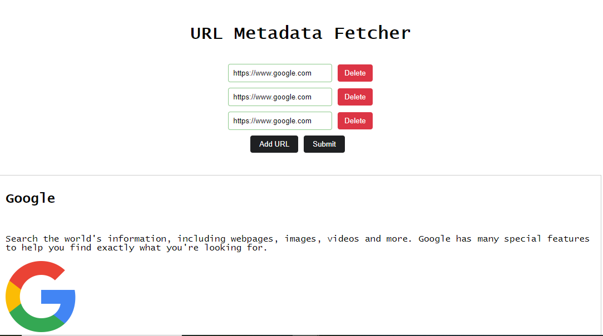

# URL Metadata Fetcher

## Project Overview

The URL Metadata Fetcher is a full-stack application designed to fetch and display metadata from a list of URLs. The application consists of a React frontend and an Express backend. The frontend allows users to input a list of URLs, fetch metadata (such as title, description, and image) for each URL, and display the results. The backend provides an endpoint to handle metadata fetching and processing.

## Features

- **Frontend**: Built with React, it includes a form for inputting URLs and displaying metadata.
- **Backend**: Built with Express, it fetches metadata from the provided URLs and handles requests from the frontend.
- **Environment Configuration**: Uses a custom configuration file (`env.js`) to switch between development and deployment modes.
- **Tests**: Tests are avaiable for both frontend and backend. use _npm run test_ in the respective folders (backend/client).

## Deployment

Currently running on: https://url-metadata-fetcher-client.vercel.app/

